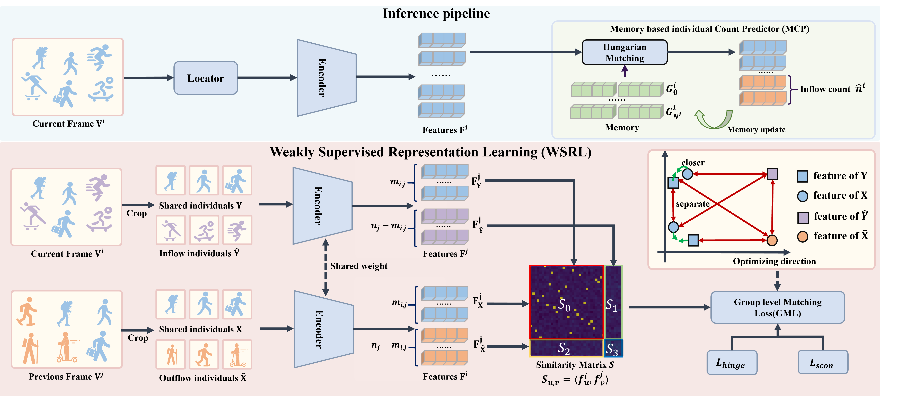

# Weakly Supervised Video Crowd Counting

Official PyTorch implementation of "Weakly Supervised Video Crowd Counting," as presented at CVPR 2024.

📄 [Read the Paper](https://openaccess.thecvf.com/content/CVPR2024/html/Liu_Weakly_Supervised_Video_Individual_Counting_CVPR_2024_paper.html)

**Authors:** Xinyan Liu, Guorong Li, Yuankai Qi, Ziheng Yan, Zhenjun Han, Anton van den Hengel, Ming-Hsuan Yang, Qingming Huang

## Overview

The Video Individual Counting (VIC) task focuses on predicting the count of unique individuals in videos. Traditional methods, which rely on costly individual trajectory annotations, are impractical for large-scale applications. This work introduces a novel approach to VIC under a weakly supervised framework, utilizing less restrictive inflow and outflow annotations. We propose a baseline method employing weakly supervised contrastive learning for group-level matching, enhanced by a custom soft contrastive loss, facilitating the distinction between different crowd dynamics. We also contribute two augmented datasets, SenseCrowd and CroHD, and introduce a new dataset, UAVVIC, to foster further research in this area. Our method demonstrates superior performance compared to fully supervised counterparts, making a strong case for its practical applicability.

## Inference Pipeline



The CGNet architecture includes:
- **Frame-level Crowd Locator**: Detects pedestrian coordinates.
- **Encoder**: Generates unique representations for each detected individual.
- **Memory-based Individual Count Predictor (MCP)**: Estimates inflow counts and maintains a memory of individual templates.

The Weakly Supervised Representation Learning (WSRL) method utilizes both inflow and outflow labels to refine the encoder through a novel Group-Level Matching Loss (GML), integrating soft contrastive and hinge losses to optimize performance.

## Demo

Our model processes video inputs to predict individual counts, operating over 3-second intervals.

<p>
  
  
  
  
</p>


## Setup

### Installation

Clone and set up the CGNet repository:

```bash
git clone https://github.com/streamer-AP/CGNet
cd CGNet
conda create -n CGNet python=3.10
conda activate CGNet
pip install -r requirements.txt
```

Data Preparation
- **CroHD** : Download CroHD dataset from this [link](https://motchallenge.net/data/Head_Tracking_21/). Unzip ```HT21.zip``` and place ``` HT21``` into the folder (```Root/dataset/```). 
- **SenseCrowd** dataset: Download the dataset from [Baidu disk](https://pan.baidu.com/s/1OYBSPxgwvRMrr6UTStq7ZQ?pwd=64xm) or from the original dataset [link](https://github.com/HopLee6/VSCrowd-Dataset). 

### Usage

1. We provide a toy example for the GML loss to quickly understand GML loss, which can also be used in other tasks. 

``` bash
cd models/
python tri_sim_ot_b.py
```
You can see the similarity matrix converging process like this:


2. Inference.
   * Before inference, you need to get crowd localization result on a pre-trained crowd localization model. You can use [FIDTM](https://github.com/dk-liang/FIDTM.git), [STEERER](https://github.com/taohan10200/STEERER.git) or any other crowd localization model that output coordinates results.
   * We also provide a crowd localization results inferenced by FIDTM-HRNet-W48. You can download it from [Baidu disk](https://pan.baidu.com/s/1i9BXHab5pVYhZFCESD6F7Q?pwd=08zg) or [Google drive](https://drive.google.com/file/d/12cMTFTf_xEiE_AYOvs1CgG91EAvbD_ew/view?usp=drive_link). The data format follows:
   ```
   x y
   x y
   ```
   * Pretrained models can be downloaded from [Baidu disk](https://pan.baidu.com/s/1GZJM6sHlFULK56UTTlIhtg?pwd=pigo) or [Google drive](https://drive.google.com/file/d/1EcEy11HVMDxPUMztC-zSIQ4jAMUStbDG/view?usp=drive_link). Unzip it in the weight folder and run the following command.
   ``` bash
    python inference.py
   ```
   * It will cost less than 2GB GPU memory. And using interval = 15(3s), the inference time will be less than 10 minutes for all datasets.
   When finished, it will generate a json file in the result folder. The data format follows:
   ```json
   {
    "video_name": {
        "video_num": the predicted vic,
        "first_frame_num": the predicted count in the first frame,
        "cnt_list": [the count of inflow in each frame],
        "pos_lists": [the position of each individual in each frame],
        "frame_num": the total frame number,
        "inflow_lists": [the inflow of each individual in each frame],
    },
    ...
   }
   ```
   * For the SenseCrowd dataset, the repoduced results of this repo is shown in results dir.
   Run the following command to evaluate the results.
   ``` bash
    python eval.py
    ```
   * For MAE and WRAE, it is slightly better than the paper. The matrics are as follows:
   ```
   | Method | MAE | RMSE | WRAE| 
    | ------ | --- | --- | --- |
    | Paper  | 8.86 | 17.69| 12.6|
    | Repo   | 8.64 | 18.70| 11.76|
    ```
3. Training.
   * For training, you need to prepare the dataset and the crowd localization results. The data format follows:
   ```
   x y
   x y
   ```
   * The training script is as follows:
   ``` bash
   python train.py
   ```
   It also supports multi-GPU training. You can set the number of GPUs by using the following command:
   ``` bash
   bash dist_train.sh 8
   ```

## Citation

If you find this repository helpful, please cite our paper:

``` bash
@inproceedings{liu2024weakly,
  title={Weakly Supervised Video Individual Counting},
  author={Liu, Xinyan and Li, Guorong and Qi, Yuankai and Yan, Ziheng and Han, Zhenjun and van den Hengel, Anton and Yang, Ming-Hsuan and Huang, Qingming},
  booktitle={Proceedings of the IEEE/CVF Conference on Computer Vision and Pattern Recognition},
  pages={19228--19237},
  year={2024}
}
```

## Acknowledgement
We thank the authors of [FIDTM](https://github.com/dk-liang/FIDTM.git) and [DR.VIC](https://github.com/taohan10200/DRNet.git) for their excellent work.

